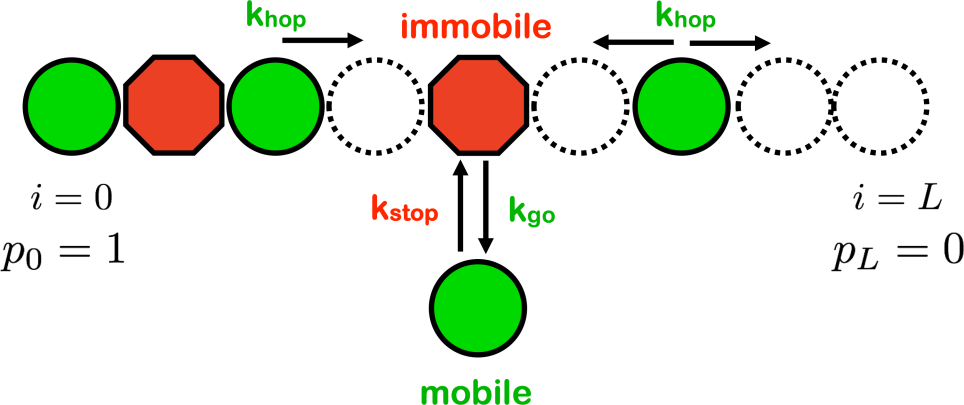

# Single-file diffusion in pores
Code for the paper "Non-Fickian single-file pore transport" https://arxiv.org/abs/2107.03498.

<p align="center"> 

</p>

## Running simulations
Simulation code in Sim/ is compiled with "make".

To run simulations for density profiles and flux (figure 2), use main.cpp with command line arguments for L, Ron, dx, D0, koff, run ID. Example: ./main 8 0.1 7 270000 0.1 0.

To run simulations for time series (figure 3 and 4), use time_series.cpp with command line arguments for L, Ron, dx, D0, koff, run ID, scale_series, and scale_numtime. scale_series sets when time for which the time series is recorded, at time=2^scale_series. scale_numtime is the number of time steps the series is recorded for.

## Plotting
Plotting code in PlottingCode/ creates the plots from data from the simulations.

## Citation
The original paper should be cited as
```
@misc{farrell2021nonfickian,
      title={Non-Fickian single-file pore transport}, 
      author={Spencer Farrell and Andrew D Rutenberg},
      year={2021},
      eprint={2107.03498},
      archivePrefix={arXiv},
      primaryClass={cond-mat.stat-mech}
}
```